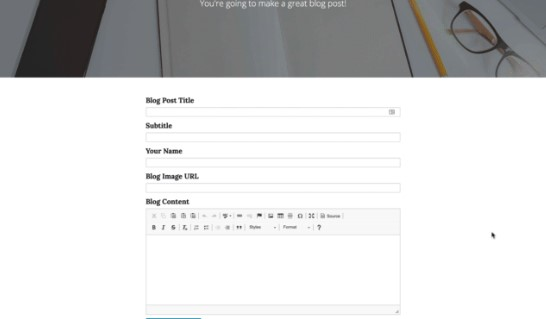

# Blogpost-website
A blogpost website with a Full-Stack architecture, a manifestation of everything we have learned this year.

## Technologies/Libraires & Modules used:
<ul>
  <li>Python</li>
  <li>CSS Bootstrap</li>
  <li>JavaScript</li>
  <li>Flask</li>
  <li>Jinja</li>
  <li>SQL_Alchemy</li>
  <li>PostgreSQL</li>
  <li>SMTPlib (email communication)</li>
  <li>OS (.env variables)</li>
</ul>

## What was learned/practiced:
<li>HTML/Jinja templating</li>
<li>Database modeling</li>
<li>Advanced authentication (hashing/salting)</li>
<li>HTML routing</li>
<li>Flask/PostgreSQL architecture</li>
<li>SQL tables and queries</li>

## Future updates/Further implementations:
1. Deploy to a WSGI server using GUnicorn
2. Dark mode
3. Create content

## A look at the website:
Website UI dependent on CSS Bootstrap and JavaScript, 
the blogpost is themed around the life of a surreal pug.
 
 
"index.html ss"
 
 
Normal user key features:
1. Read any posts
2. View comments on any post
3. Create comments
4. Send emails
 
"post.html ss"
 
 
Admin user key features:
1. Create posts
2. Update posts
3. Delete posts
 
“make-post.html ss”

 
 
Communication/contact with the website administrator established through email:
 
 
 “contact.html ss"
